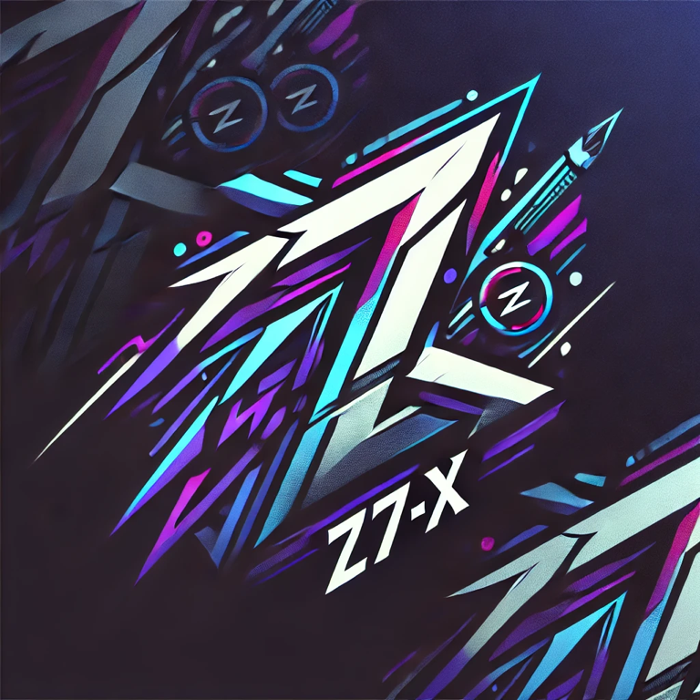

</img>

z7-micro-small
-------
z7-micro-small 是一个基于最新的SpringCloud2.x的微服务商业开发脚手架->(非教学版),支持公司全方位应用架构搭建.

第一阶段:
* 配置中心的配置管理：读取各个服务的配置文件、动态刷新配置
* 网关的路由管理：动态路由、限流、熔断、监控
* 后台服务(web-service,app-service)API文档管理
* 认证中心(oauth2):token、身份认证、权限管理

第二阶段：
* 服务中心的日志管理：收集日志，超过指定大小对日志压缩打包
* 用户管理中心(user-service):用户管理、角色管理、权限管理，参考RBAC模型

第三阶段：
* 第三方消息队列：引入消息队列rabbitmq，用于同步、异步消息消费
* 文件系统：引入文件系统，用于文件上传、下载

## Features
* 基于Eureka的服务管理
* 基于Spring-Cloud-Config的配置管理
* 基于Spring-Oauth2的jwt鉴权服务
* 基于Elastic-Job的分布式job
* 基于SpringAdmin的监控服务
* 基于Zipkin的链路监控服务
* 基于SpringCloudStream的消息驱动
* 基于SpringSecurity的cookie的sso统一登陆服务
* 支持网关的动态配置和流量控制
* 支持SpringSession的session管理
* 支持Redis的数据服务缓存
* 支持Hystrix的服务熔断管理
* 支持swagger2的api管理
* 支持Kafka,RabbitMQ,Rocketmq的消息接入
* 支持Spring-Oauth2的sso
* 支持Spring-Security的cas客户端
* 支持FastDfs的客户端

## Docker
使用 docker-compose 部署Docker镜像

## 组件
z7-micro-small 目前作为个人学习使用，由`eureka`, `auth`,`config`,`gateway`组成

### Eureka
Eureka服务发现管理,支持高可用配置[更多](./docs/md/z7-discovery.md)。

### Auth
Spring Oauth2鉴权管理支持jwt鉴权[更多](./docs/md/z7-auth)。

### Config
Spring config的配置服务管理[更多](./docs/md/z7-config.md)。

### Gateway
Gateway的网关服务，支持动态配置网关[更多](./docs/md/z7-gateway.md)。

### Web-service
Web-service统一为后端服务入口,提供给web端的服务调用[更多](./docs/md/z7-web-service.md)。

### App-service
App-service统一为后端服务入口，提供给app端的服务调用[更多](./docs/md/z7-app-service.md)。

# 交流方式(QQ) 添加时需注明来意
</img>
